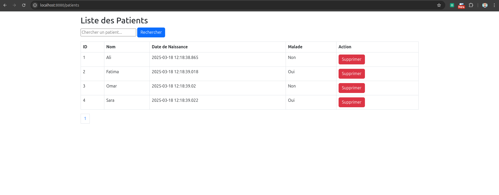

# Gestion des Patients avec Spring MVC et Thymeleaf



## Description

Cette application Web permet de gérer une liste de patients. Elle offre des fonctionnalités telles que :

- Affichage des patients avec pagination
- Recherche de patients par nom
- Suppression d'un patient

## Technologies Utilisées

- **Spring MVC** : Framework pour construire des applications web en utilisant le modèle MVC.
- **Thymeleaf** : Moteur de template pour générer des vues côté serveur.
- **Spring Data JPA** : Abstraction pour interagir avec la base de données relationnelle.
- **H2 Database** : Base de données en mémoire utilisée pour le développement et les tests.
- **Bootstrap** : Framework CSS pour un design réactif et moderne.

## Prérequis

- **JDK 17** ou supérieur
- **Maven 3.8** ou supérieur

## Installation et Exécution

1. **Cloner le dépôt :**

   ```bash
   git clone https://github.com/El-hathat/Spring-MVC_thymeleaf.git
   cd Spring-MVC_thymeleaf
